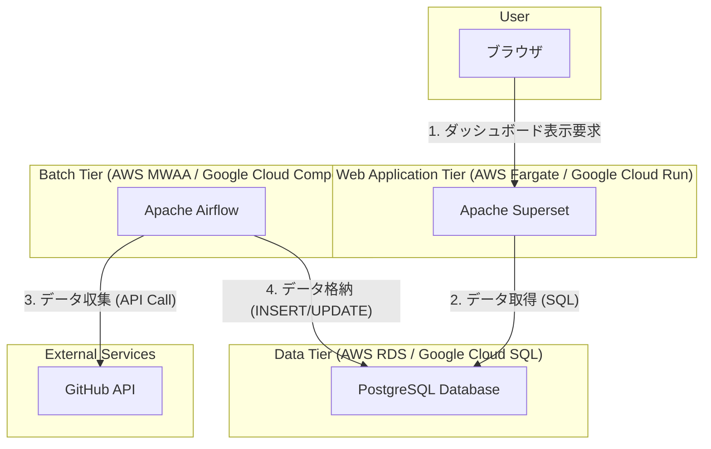

# 03. アーキテクチャ設計

## 1. 全体構成図

本システムは、以下の3つの主要コンポーネントから構成される。

## 2. コンポーネントの役割
### 2.1. Web Application (Apache Superset)
- 役割: ユーザーにダッシュボードを提供するフロントエンドおよびBI層。

- 責務:

  - ユーザー認証（GitHub SSO連携）。

  - PostgreSQLに格納されたデータをSQLで集計し、グラフやテーブルとして可視化する。

  - フィルタリングやドリルダウンなどのインタラクティブな操作を提供する。

  - クエリ結果のキャッシュによる表示高速化。

## 2.2. Database (PostgreSQL)
- 役割: CI/CDの実行データを格納する永続化層。

- 責務:

  - Airflowによって収集・整形されたデータを格納する。

  - Supersetからの読み取りクエリに応答する。

  - データモデルは data_model.md にて定義される。

## 2.3. Data Collector (Apache Airflow)
- 役割: 外部CI/CDツールからデータを定期的に収集するバッチ処理層。

- 責務:

  - GitHub Appとして認証し、GitHub APIを定期的に呼び出す。

  - 取得した実行ログ（JSON形式）を、data_model.md に基づくテーブル形式に変換する。

  - 変換したデータをPostgreSQLに保存する。

  - 処理の失敗検知、リトライ、アラート通知を行う。

  - 詳細は [DAG設計](./dag_design.md)を参照。

## 3. デプロイ環境
- 本番環境: AWSやGoogle Cloudなどのクラウドプラットフォーム上のマネージドサービスを活用する。

  - Superset: AWS Fargate / Google Cloud Run

  - PostgreSQL: AWS RDS / Google Cloud SQL

  - Airflow: AWS MWAA / Google Cloud Composer

- ローカル開発環境: docker-compose を用いて、上記3コンポーネントをコンテナとして起動する。
