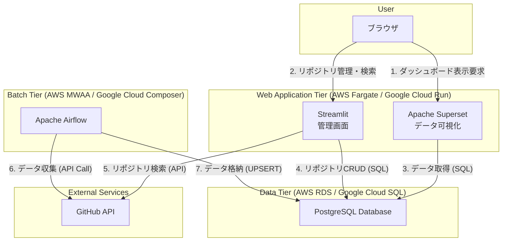

# 03. アーキテクチャ設計

## 1. 全体構成図

本システムは、以下の4つの主要コンポーネントから構成される。

## 2. コンポーネントの役割
### 2.1. Web Application (Apache Superset)
- 役割: ユーザーにダッシュボードを提供するフロントエンドおよびBI層。

- 責務:

  - ユーザー認証（GitHub SSO連携）。

  - PostgreSQLに格納されたデータをSQLで集計し、グラフやテーブルとして可視化する。

  - フィルタリングやドリルダウンなどのインタラクティブな操作を提供する。

  - クエリ結果のキャッシュによる表示高速化。

### 2.2. Admin UI (Streamlit)
- 役割: リポジトリ管理とシステム運用のための管理画面。

- 責務:

  - 監視対象リポジトリの追加・有効化・無効化。

  - GitHub APIからのリポジトリ検索とインポート機能。
    - 組織リポジトリの一覧取得
    - ユーザーリポジトリの一覧取得
    - キーワード検索（GitHub検索構文対応）
    - ページネーション機能（10/20/30/50件表示）

  - ダッシュボード（リポジトリ統計、最近のパイプライン実行履歴）。

  - パイプライン実行履歴の閲覧とフィルタリング。

  - PostgreSQLへの直接的なCRUD操作（リポジトリテーブル）。

## 2.3. Database (PostgreSQL)
- 役割: CI/CDの実行データを格納する永続化層。

- 責務:

  - Airflowによって収集・整形されたデータを格納する。

  - SupersetおよびStreamlitからの読み取りクエリに応答する。

  - Streamlitからのリポジトリ管理CRUD操作を処理する。

  - データモデルは data_model.md にて定義される。

## 2.4. Data Collector (Apache Airflow)
- 役割: 外部CI/CDツールからデータを定期的に収集するバッチ処理層。

- 責務:

  - GitHub Appまたはトークンとして認証し、GitHub APIを定期的に呼び出す。

  - 取得した実行ログ（JSON形式）を、data_model.md に基づくテーブル形式に変換する。

  - 変換したデータをPostgreSQLにUPSERT（冪等性保証）する。

  - 堅牢なエラーハンドリング:
    - GitHub API Rate Limit監視と自動待機
    - 一時的エラーの自動リトライ（指数バックオフ）
    - 部分的失敗時の継続処理とエラー統計記録

  - 処理の失敗検知、リトライ、アラート通知を行う。

  - 詳細は [DAG設計](./dag_design.md)および[エラーハンドリングガイド](../04_operation/error_handling.md)を参照。

## 3. デプロイ環境
- 本番環境: AWSやGoogle Cloudなどのクラウドプラットフォーム上のマネージドサービスを活用する。

  - Superset: AWS Fargate / Google Cloud Run

  - Streamlit: AWS Fargate / Google Cloud Run

  - PostgreSQL: AWS RDS / Google Cloud SQL

  - Airflow: AWS MWAA / Google Cloud Composer

- ローカル開発環境: docker-compose を用いて、上記4コンポーネントをコンテナとして起動する。

  - Superset: http://localhost:8088
  - Streamlit: http://localhost:8501
  - Airflow: http://localhost:8080
  - PostgreSQL: localhost:5432
