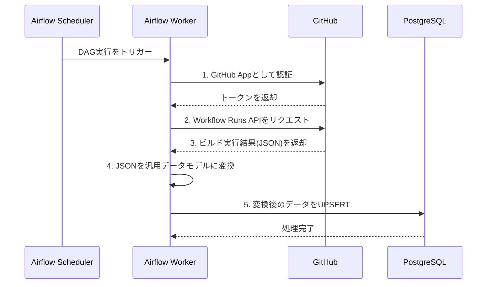
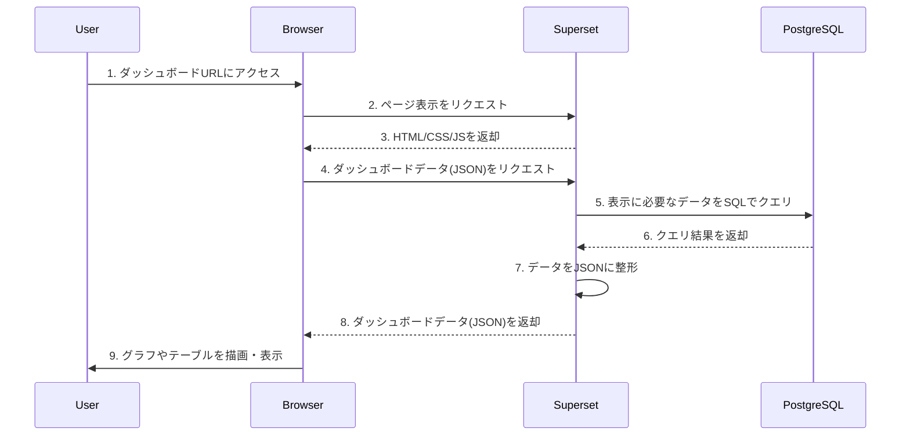

# 04. シーケンス図

## 1. データ収集シーケンス (定時バッチ実行)

```mermaid
sequenceDiagram
    participant Scheduler as Airflow Scheduler
    participant Worker as Airflow Worker
    participant GitHub
    participant Database as PostgreSQL

    Scheduler->>Worker: DAG実行をトリガー
    Worker->>GitHub: 1. GitHub Appとして認証
    GitHub-->>Worker: トークンを返却
    Worker->>GitHub: 2. Workflow Runs APIをリクエスト
    GitHub-->>Worker: 3. ビルド実行結果(JSON)を返却
    Worker->>Worker: 4. JSONを汎用データモデルに変換
    Worker->>Database: 5. 変換後のデータをUPSERT
    Database-->>Worker: 処理完了
```

## 2. ユーザー操作シーケンス (ダッシュボード表示)

```mermaid
sequenceDiagram
    participant User
    participant Browser
    participant Superset
    participant Database as PostgreSQL

    User->>Browser: 1. ダッシュボードURLにアクセス
    Browser->>Superset: 2. ページ表示をリクエスト
    Superset-->>Browser: 3. HTML/CSS/JSを返却
    Browser->>Superset: 4. ダッシュボードデータ(JSON)をリクエスト
    Superset->>Database: 5. 表示に必要なデータをSQLでクエリ
    Database-->>Superset: 6. クエリ結果を返却
    Superset->>Superset: 7. データをJSONに整形
    Superset-->>Browser: 8. ダッシュボードデータ(JSON)を返却
    Browser->>User: 9. グラフやテーブルを描画・表示
```
